<h1 align="center">Hi, I'm Wildan </h1>

  <b>Full Stack Developer</b> from Tabalong, Kalimantan Selatan, Indonesia 
  Currently working at <b>Dinas Komunikasi dan Informatika Kabupaten Tabalong</b>

  
  
  
  

---

### About Me

- Building government digital services & internal tools at **Diskominfo Tabalong**
- Currently exploring **AI/RAG systems** with LangChain, Qdrant, and multi-model LLM pipelines
- Building full-stack apps with **Next.js**, **TanStack Start**, and **Nuxt/Nitro**
- Comfortable across the stack: **frontend**, **backend**, **mobile**, **DevOps**

---

### Stack I work with

  

**Also** · TanStack Start · Nuxt · FastAPI · tRPC · Prisma · Redis · Firebase · GitHub Actions · better-auth

---

### GitHub Stats

  
  

  

---

  

